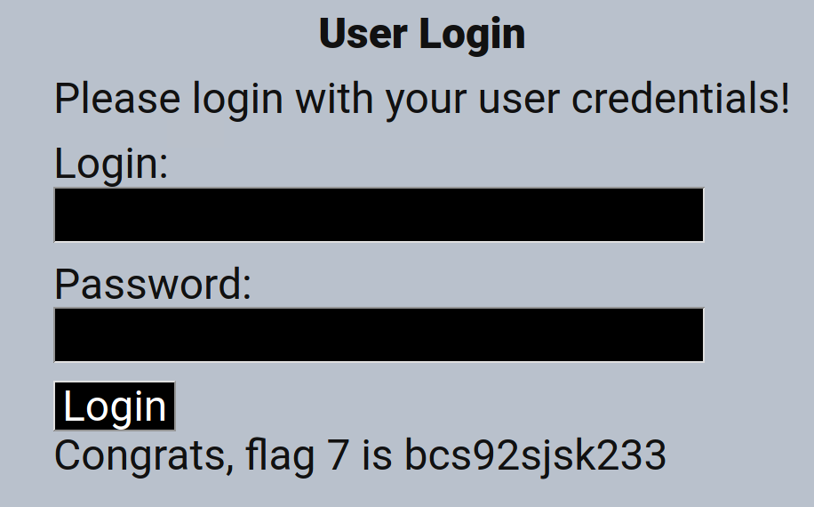
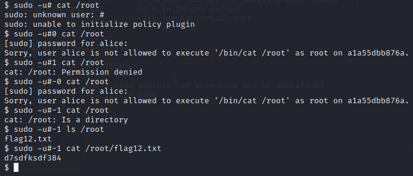
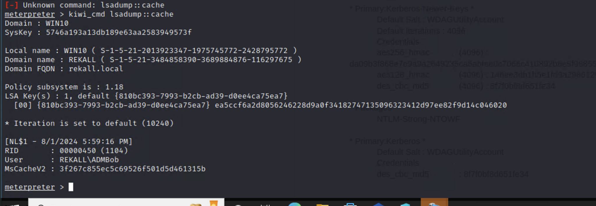

# Rekall Corporation — Penetration Testing Engagement

A 3-day authorized pen test against a fictional company's web application, Linux servers, and Windows servers. Team of three, UofT cybersecurity program (2024).

## What We Found

The environment was intentionally vulnerable, but the findings mirrored real-world patterns I've since seen referenced in CVE databases and OWASP reports:

- **SQL injection on the web app** — classic unsanitized input. We used Burp Suite to map the injection points and a `' OR 1=1 --` payload to bypass the admin login. The app also handed over data through its exposed database.
- **Remote code execution** — unpatched Apache Struts (CVE-2017-5638), Tomcat (CVE-2017-12617), and Drupal (CVE-2019-6340). Metasploit had modules ready for each. Once we had a shell, privilege escalation to root came through a sudo flaw (CVE-2019-14287).
- **Shellshock on Linux** — the bash vulnerability from 2014, still present. Nmap's scripting engine flagged it, and Metasploit's `apache_mod_cgi_bash_env_exec` module confirmed it.
- **Weak credentials on Windows** — default and dictionary passwords on multiple accounts. John the Ripper cracked them in minutes. From there, dumping cached hashes with the kiwi module opened a path to the domain controller.

Every finding led to either system compromise or access to sensitive data. We documented exploitation steps, evidence, and remediation recommendations in the full report.

## Exploitation Evidence

The kill chain ran from a web-app foothold to Linux root to the Windows domain controller. Credentials and hashes shown below are synthetic lab artifacts from the sandboxed environment.

**1. SQL injection — authentication bypass on `Login.php`.** A `' OR 1=1 --` payload bypassed the admin login.

**2. Privilege escalation to root — sudo CVE-2019-14287.** Running `sudo -u#-1 cat /root/...` as `alice` executed the command as root, bypassing the sudoers policy.

**3. Domain controller compromise.** With a Meterpreter session on the domain, the kiwi module dumped cached credentials for the `REKALL\ADMBob` account.

## Findings

Severity and remediation come from the report's own finding cards. The report documents 21 findings in total across the web application, Linux hosts, and Windows hosts; the headline findings are below.

| Vuln | Severity | Exploited Via | Remediation |
|------|----------|---------------|-------------|
| SQL injection (`Login.php`) | Critical | `' OR 1=1 --` payload bypassed the admin login | Parameterized queries and server-side input validation |
| Reflected & stored XSS | Critical | Script injection on `Welcome.php`, `Memory-Planner.php`, `Comments.php` | Input validation and output encoding |
| Unrestricted file upload | High | `dawn.php.jpg` extension bypass on the image uploaders | Allow-list extensions and verify MIME type |
| Broken admin access control | Critical | Admin credentials readable in page HTML via Inspect Element | Keep secrets out of client-side code; serve over HTTPS |
| Sensitive data exposure | High | `robots.txt` disclosed restricted paths and a flag | Do not place secrets in publicly reachable files |
| Directory traversal | Medium | Traversal payload in the DNS-check input field | Validate input; resolve files through a path allow-list |
| Apache Struts RCE (CVE-2017-5638) | Critical | Metasploit `struts2_content_type_ognl` | Patch or upgrade Apache Struts |
| Apache Tomcat RCE (CVE-2017-12617) | Critical | Remote file execution to an interactive shell | Patch or upgrade Apache Tomcat |
| Shellshock | Critical | Metasploit `apache_mod_cgi_bash_env_exec`, then root via sudoers | Patch Bash |
| Drupal RCE (CVE-2019-6340) | Critical | Metasploit `drupal_restws_unserialize` | Patch or upgrade Drupal |
| Sudo privilege escalation (CVE-2019-14287) | Critical | `sudo -u#-1` ran as root for user `alice` | Patch sudo |
| Credentials exposed on public GitHub | Critical | OSINT recovered a password hash (`trivera`) from a public repo | Remove secrets from repositories; rotate credentials |
| Anonymous FTP, port 21 | Critical | Anonymous login on the Windows 10 host | Disable anonymous FTP; use SFTP or FTPS |
| Vulnerable SLMail version | Critical | Metasploit `seattlelab_pass` returned a Meterpreter shell | Patch or update SLMail |
| Weak passwords → domain admin | High | NTLM/MsCacheV2 hashes cracked with John the Ripper and dumped via kiwi, reaching the domain controller | Enforce strong passwords and MFA |

## Tools

Kali Linux, Metasploit Framework, Burp Suite, Nmap, Nikto, John the Ripper, Hashcat, Recon-ng

## Report

The full penetration test report with the complete findings set, exploitation chains, and remediation steps: **[Penetration Test Report (PDF)](Penetration_Test_Report.pdf)**

## Related

For the defensive counterpart to this engagement — a Splunk SIEM built to detect this class of attack — see **[vsi-splunk-siem](https://github.com/tylerbcrawford/vsi-splunk-siem)**.

## Context

This was a capstone-style project for UofT's cybersecurity certificate program. Authorized testing in a sandboxed lab environment.
